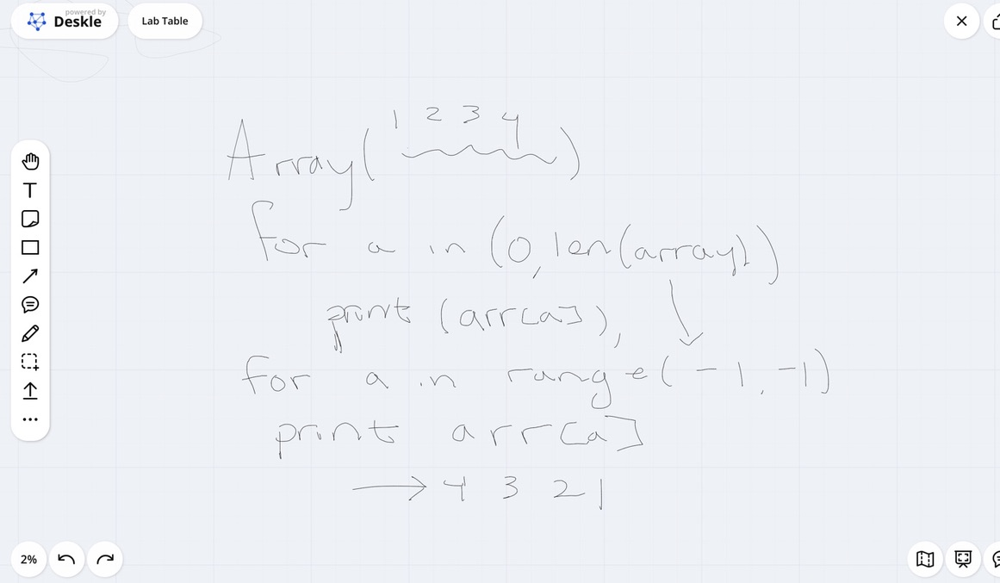
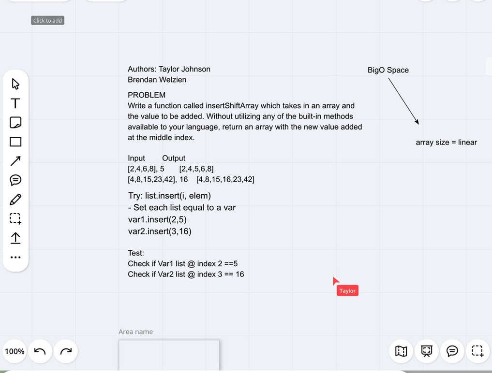
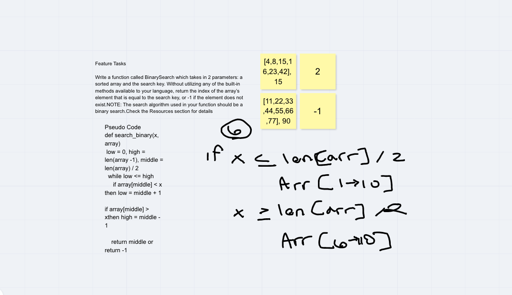
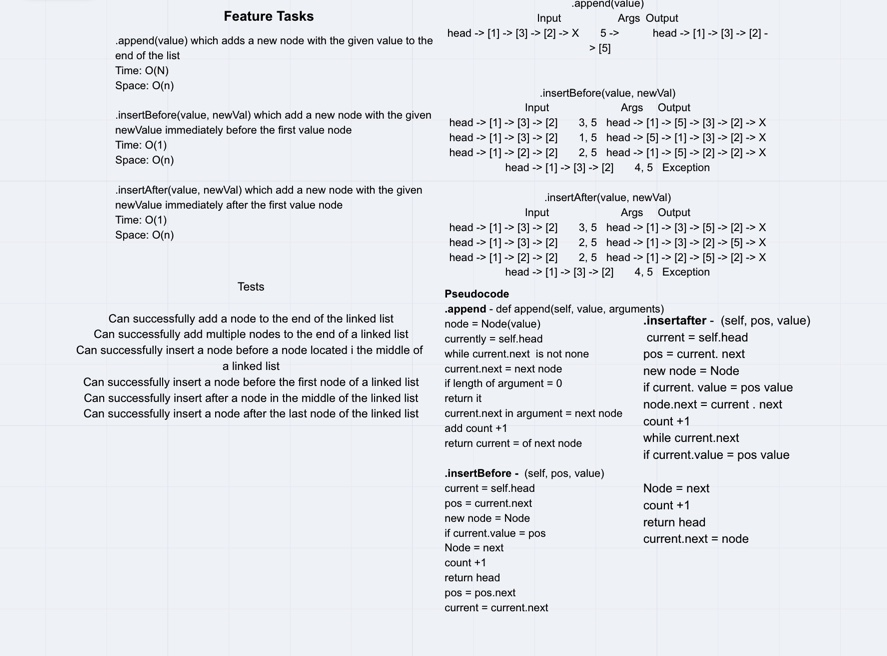
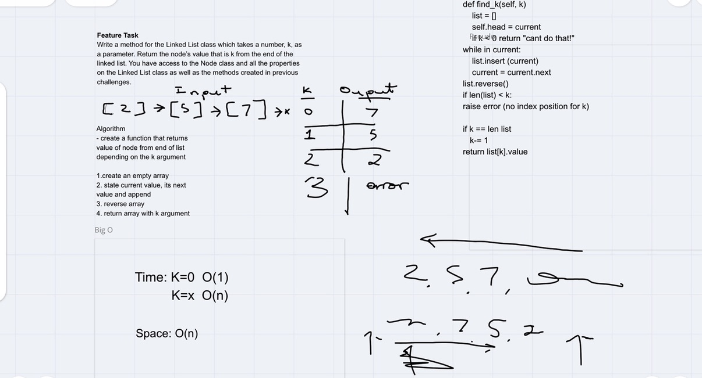
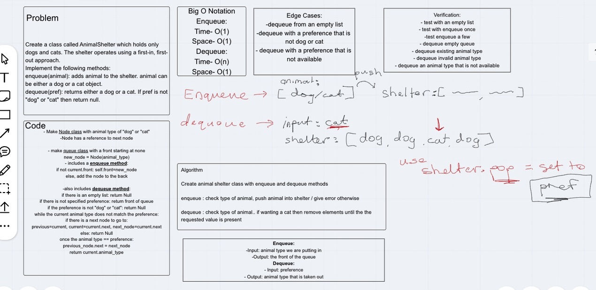
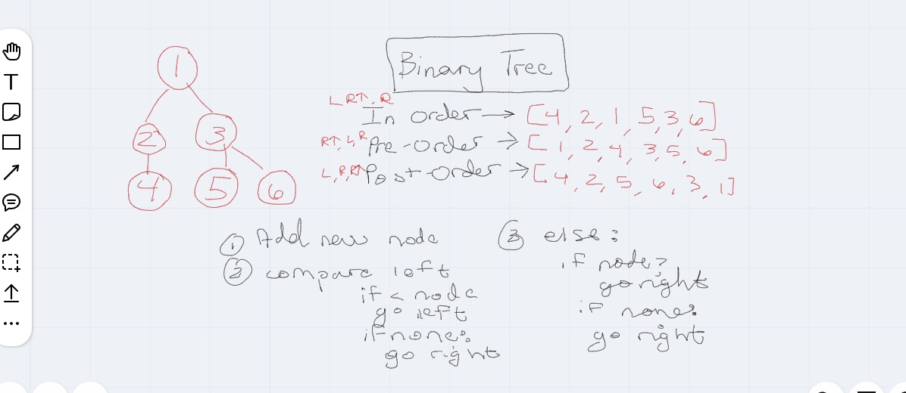
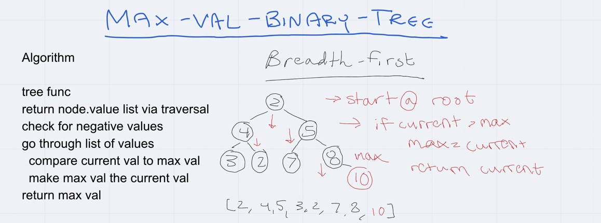
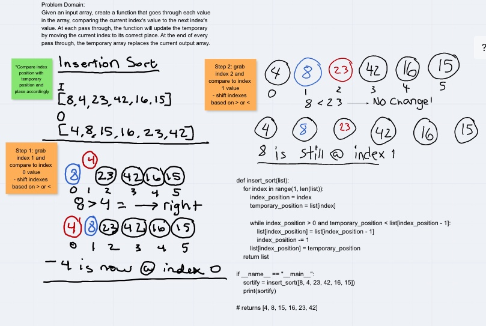

# Data Structures and Algorithms

## Language: `Python`


# Reverse an Array
<!-- Short summary or background information -->

## Challenge
Write a function called reverseArray which takes an array as an argument. Without utilizing any of the built-in methods available to your language, return an array with elements in reversed order.

## Approach & Efficiency
Use a loop to iterate through the length of an array and then subtract the array's length by one pertinent to its index.

## Solution


# Shift an Array

## Challenge
Write a function called insertShiftArray which takes in an array and the value to be added. Without utilizing any of the built-in methods available to your language, return an array with the new value added at the middle index.

## Approach & Efficiency
By inserting a value into an existing array we used the list.insert method to give the value the required positioning. This can be applied by setting the value to a variable and using .insert with the index position.
## Solution


# Array Binary Search

## Challenge

Feature Tasks
Write a function called BinarySearch which takes in 2 parameters: a sorted array and the search key. Without utilizing any of the built-in methods available to your language, return the index of the array’s element that is equal to the search key, or -1 if the element does not exist.
NOTE: The search algorithm used in your function should be a binary search.
Check the Resources section for details
Example
Input	                        Output
[4,8,15,16,23,42], 15	          2
[11,22,33,44,55,66,77], 90	   -1

## Approach & Efficiency
Set the list of numbers to a variable and declare the length of that list. Distinguish the low, mid, and high of the list by using the len(list) method and divide accordingly. Given the specified key number, set the key to equal, less than, or greater than the len(list) to isolate the search.


## Solution


 # Linked List Insertions

 ## Challenge
Feature Tasks

Write the following methods for the Linked List class:

.append(value) which adds a new node with the given value to the end of the list
.insertBefore(value, newVal) which add a new node with the given newValue immediately before the first value node
.insertAfter(value, newVal) which add a new node with the given newValue immediately after the first value node

 ## Approach and Efficiency
.append(value)
Input	                        Args	               Output
head -> [1] -> [3] -> [2] -> X	5	head -> [1] -> [3] -> [2] -> [5] -> X
head -> X	1	head -> [1] -> X
.insertBefore(value, newVal)
Input	Args	Output
head -> [1] -> [3] -> [2] -> X	3, 5	head -> [1] -> [5] -> [3] -> [2] -> X
head -> [1] -> [3] -> [2] -> X	1, 5	head -> [5] -> [1] -> [3] -> [2] -> X
head -> [1] -> [2] -> [2] -> X	2, 5	head -> [1] -> [5] -> [2] -> [2] -> X
head -> [1] -> [3] -> [2] -> X	4, 5	Exception
.insertAfter(value, newVal)
Input	Args	Output
head -> [1] -> [3] -> [2] -> X	3, 5	head -> [1] -> [3] -> [5] -> [2] -> X
head -> [1] -> [3] -> [2] -> X	2, 5	head -> [1] -> [3] -> [2] -> [5] -> X
head -> [1] -> [2] -> [2] -> X	2, 5	head -> [1] -> [2] -> [5] -> [2] -> X
head -> [1] -> [3] -> [2] -> X	4, 5	Exception

 ## Solution


# Kth from End

## Challenge
Write a method for the Linked List class which takes a number, k, as a parameter. Return the node’s value that is k from the end of the linked list. You have access to the Node class and all the properties on the Linked List class as well as the methods created in previous challenges.


## Approach and Efficiency
Create an array where current value and a following value runs through the the node list. Set a counter to increase for when the current value shifts to the next value. When the current is at the end/tail of the list return the value of k (argument).


## Solution



# Stacks and Queues

## Challenge
Feature Tasks:
Create a Node class that has properties for the value stored in the Node, and a pointer to the next node.

Create a Stack class that has a top property. It creates an empty Stack when instantiated.

This object should be aware of a default empty value assigned to top when the stack is created.
Define a method called push which takes any value as an argument and adds a new node with that value to the top of the stack with an O(1) Time performance.
Define a method called pop that does not take any argument, removes the node from the top of the stack, and returns the node’s value.
Should raise exception when called on empty stack
Define a method called peek that does not take an argument and returns the value of the node located on top of the stack, without removing it from the stack.
Should raise exception when called on empty stack
Define a method called isEmpty that takes no argument, and returns a boolean indicating whether or not the stack is empty.

Create a Queue class that has a front property. It creates an empty Queue when instantiated.

This object should be aware of a default empty value assigned to front when the queue is created.
Define a method called enqueue which takes any value as an argument and adds a new node with that value to the back of the queue with an O(1) Time performance.
Define a method called dequeue that does not take any argument, removes the node from the front of the queue, and returns the node’s value.
Should raise exception when called on empty queue
Define a method called peek that does not take an argument and returns the value of the node located in the front of the queue, without removing it from the queue.
Should raise exception when called on empty queue
Define a method called isEmpty that takes no argument, and returns a boolean indicating whether or not the queue is empty.


## Approach and Efficiency
Create Node instantiation with parameters of self and value. Also create classes that include parameters for the front, rear, and top of the call stack. Build methods such as pop, push, empty, and queue to give complexity to the stack.
Big O complexity --> O(1) for *peek, is_empty, push, pop, enqueue, dequeue*

# Animal Shelter

## Challenge
Create a class called AnimalShelter which holds only dogs and cats. The shelter operates using a first-in, first-out approach.
Implement the following methods:
enqueue(animal): adds animal to the shelter. animal can be either a dog or a cat object.
dequeue(pref): returns either a dog or a cat. If pref is not "dog" or "cat" then return null.


## Approach and Efficiency
Create animal shelter class with enqueue and dequeue methods
enqueue : check type of animal, push animal into shelter / give error otherwise
dequeue : check type of animal.. if wanting a cat then remove elements until the the requested value is present

## Solution


# Binary Tree

## Challenge
Create a Node class that has properties for the value stored in the node, the left child node, and the right child node.

Create a BinaryTree class
Define a method for each of the depth first traversals called preOrder, inOrder, and postOrder which returns an array of the values, ordered appropriately.

Any exceptions or errors that come from your code should be semantic, capturable errors. For example, rather than a default error thrown by your language, your code should raise/throw a custom, semantic error that describes what went wrong in calling the methods you wrote for this lab.

Create a BinarySearchTree class
Define a method named add that accepts a value, and adds a new node with that value in the correct location in the binary search tree.

Define a method named contains that accepts a value, and returns a boolean indicating whether or not the value is in the tree at least once.
## Approach and Efficiency
Create methods for traversing the tree where you check the root value and insert it to the left or right according to whether it is smaller or larger than the parent root. Return array of values and verify whether the methods work by inserting a set of numbers through testing.


## Solution


# Maximum Value Binary Tree

## Challenge
Write an instance method called find-maximum-value. Without utilizing any of the built-in methods available to your language, return the maximum value stored in the tree. You can assume that the values stored in the Binary Tree will be numeric.

## Approach and Efficiency
Write a max value function that evaluates the rows of a binary tree. The row of each binary tree will be assessed via its left and right where the node values will be compared to the current value / max value.
## Solution



# Insertion Sorting

### Worked with Yoni Palagashvilli
## Challenge
Given an input array, create a function that goes through each value in the array, comparing the current index's value to the next index's value. At each pass through, the function will update the temporary by moving the current index to its correct place. At the end of every pass through, the temporary array replaces the current output array.
## Blog
1. Compare the index position with a temporary position and shift the index positions accordingly.

`[8*, 4*, 23, 42, 16, 15]`

2. grab index 1 and compare its value to index 0 --> 8 > 4, so move 8 to the right
  `[4*, 8*, 23, 42, 16, 15]`

3. grab index 2 and compare its value to index 1 --> 4 < 8 means there is no movement that needs to occur
  `[4*, 8*, 23, 42, 16, 15]`

4. grab index 3 and compare its value to index 2 --> 8 < 23, means there is no movement that needs to occur...
  `[4, 8*, 23*, 42, 16, 15]`
5. Do this until a value you are comparing is greater than the temporary position
6. Now, we reach index 3 and 4 --> when comparing index 4 to 3, 42 > 16, so 42 needs to move to the right and 16 now needs to move to the left until its value is in the appropriate position
  `[4, 8, 23, 42*, 16*, 15]`
  - we want it to be `[4, 8, 16*, 23, 42*, 15]`
7. Repeat step 6 for the last index position
8. You should then have a sorted list/array


### Folder and Challenge Setup

Each type of code challenge has slightly different instructions. Please refer to the notes and examples below for instructions for each DS&A assignment type.

### Data Structure: New Implementation

- Create a new folder under the `python` level, with the name of the data structure and complete your implementation there
  - i.e. `linked_list`
- Implementation (the data structure "class")
  - The implementation of the data structure should match package name
    - i.e. `linked_list/linked_list.py`
  - Follow Python [naming conventions](https://www.python.org/dev/peps/pep-0008/#naming-conventions)

    ```python
    class LinkedList:
      def __init__(self):
        # ... initialization code

      def method_name(self):
        # method body
    ```

- Tests
  - Within folder `tests` create a test file called `test_[data_structure].py`
    - i.e. `tests/test_linked_list.py`
    - Your tests will then need to require the data structure you're testing
      - i.e. `from linked_list.linked_list import LinkedList`

### Data Structure: Extending an implementation

- Work within the existing data structure implementation
- Create a new method within the class that solves the code challenge
  - Remember, you'll have access to `self` within your class methods
- Tests
  - You will have folder named `tests` and within it, a test file called `test_[data_structure].py`
    - i.e. `tests/test_linked_list.py`
    - Add to the tests written for this data structure to cover your new method(s)

### Code Challenge / Algorithm

Code challenges should be completed within a folder named `code_challenges` under the `python` level

- Daily Setup:
  - Create a new folder under the `python` level, with the name of the code challenge
    - Each code challenge assignment identifies the branch name to use, for example 'find-maximum-value'
    - For clarity, create your folder with the same name, ensuring that it's `snake_cased`
    - i.e. For a challenge named 'find_maximum_value', create the folder:`code_challenges/find_maximum_value`
  - Code Challenge Implementation
    - Each code challenge requires a function be written, for example "find maximum value"
    - Name the actual challenge file with the name of the challenge, in `snake_case`
      - i.e. `find_maximum_value.py`
    - Reminder: Your challenge file will then need to require the data structure you're using to implement
      - i.e. `from linked_list.linked_list import LinkedList`
    - Your challenge function name is up to you, but name something sensible that communicates the function's purpose. Obvious is better than clever
      - i.e. `find_maximum_value(linked_list)`
  - Tests
    - Ensure there is a `tests` folder at the root of project.
      - i.e. a sibling of this document.
    - within it, a test file called `test_[challenge].py`
      - i.e. `tests/find_maximum_value.py`
      - Your test file would require the challenge file found in the directory above, which has your exported function
        - i.e. `from code_challenges.find_maximum_value import find_maximum_value`

## Running Tests

If you setup your folders according to the above guidelines, running tests becomes a matter of deciding which tests you want to execute.  Jest does a good job at finding the test files that match what you specify in the test command

From the root of the `data-structures-and-algorithms/python` folder, execute the following commands:

- **Run every possible test** - `pytest`
- **Run filtered tests** - `pytest -k some_filter_text`
- **Run in watch mode** - `ptw` or `pytest-watch`
